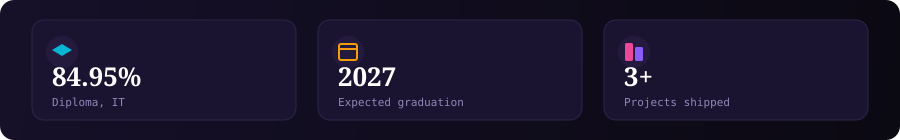
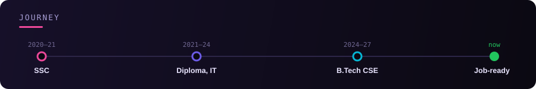
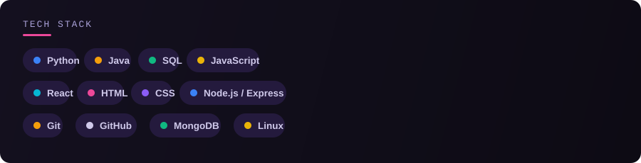

  
  
  
  

### About

Final-year B.Tech CSE student (DBATU University) who likes building things
end-to-end — an encrypted file-transfer tool, a full-stack lead-management
dashboard, a real-time face-recognition attendance system. Currently
sharpening problem-solving on LeetCode.

### 🚀 Featured Projects

| Project | What it does |
|---|---|
| **[Secure File Transfer Tool](https://github.com/vraut130512-maker/secure-transfer)** | Encrypted client-server file transfer over raw Python sockets |
| **[Smart Leads Dashboard](https://github.com/vraut130512-maker/smart-leads-dashboard)** | Full-stack lead management — React, TypeScript, Node.js, MongoDB, JWT auth |

### 🔥 GitHub Activity

  

  

